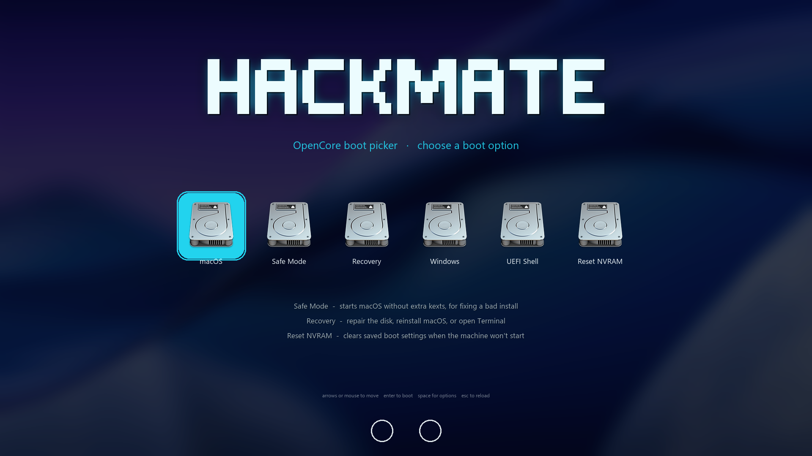

# HackMate-Core

A branded graphical boot picker for OpenCore.

Instead of OpenCore's black-and-white text menu, you boot into this:


I'm looking at this and i'm thinking how did i do this.. It's crazy how far hackmate has gotten.

The HackMate banner over a blurred macOS Tahoe backdrop, a short legend for what
Safe Mode / Recovery / Reset NVRAM actually do, mouse support, readable entry
names.

## It's not a fork

OpenCore is **unmodified**. HackMate-Core is two things:

1. An **OpenCanopy theme** — a `Resources/` folder (background, icons, fonts,
   labels). OpenCanopy is Acidanthera's own graphical picker; it ships with
   every OpenCore release as `OpenCanopy.efi`.
2. A few **`config.plist` keys** that switch the picker on and point it at the
   theme.

Nothing about the boot chain, security model, or update path changes. Proven on
a real ThinkPad T480s (macOS 26.5.2): graphical picker at native 1920×1080,
trackpad cursor, all boot entries, macOS boots through it.

## Install

You need an existing, working OpenCore EFI.

**Automatic** (patches `config.plist` + merges the theme in):

```
python hackmate_core.py install /Volumes/EFI/EFI/OC
```

Add `--minimal` for no shutdown/restart buttons, `--resolution 2560x1440` to
pick the matching background, `--oc-release /path/to/OpenCore-1.0.7-RELEASE` if
`OpenCanopy.efi` isn't already in your `Drivers/` folder.

**Manual:**

1. Copy `Resources/Image/HackMate/` into `EFI/OC/Resources/Image/`. If your
   `Resources/` has no `Font/` or `Label/`, copy those from this repo too.
2. Put `OpenCanopy.efi` (from your OpenCore release, matching your
   `OpenCore.efi` version) in `EFI/OC/Drivers/` and add it to `UEFI > Drivers`
   with `Enabled = true`.
3. In `config.plist > Misc > Boot`:

   | key | value |
   | --- | --- |
   | `PickerMode` | `External` |
   | `PickerVariant` | `HackMate\Core` |
   | `PickerAttributes` | `145` (or `209` for minimal) |

   and `UEFI > Output > ProvideConsoleGop = true`.

Then reboot.

## Styles

- **full** (`PickerAttributes 145`) — banner, legend, shutdown/restart buttons
- **minimal** (`209`) — same, no shutdown/restart buttons

## Resolution

`Background.icns` is centred, not stretched. Three variants ship:
`Background.icns` (1080p), `Background_1440p.icns`, `Background_2160p.icns`. The
`install` command with `--resolution` swaps in the right one; otherwise rename
the file yourself, or regenerate (below). A mismatch just letterboxes against
`DefaultBackgroundColor` (black).

For a 4K panel also set NVRAM `UIScale` to `02`.

## Rebuild the theme

`tools/build_theme.py` regenerates `Resources/` — composites the `BANNER` over a
wallpaper (blurred, darkened), redraws `Apple.icns`, tints the selection chrome,
and pulls `Font/` + `Label/` from OcBinaryData:

```
python tools/build_theme.py \
  --wallpaper /path/to/wallpaper.jpg \
  --ocbinary  /path/to/OcBinaryData \
  --goldengate /path/to/OcBinaryData/Resources/Image/Acidanthera/GoldenGate
```

`--blur`, `--brightness`, `--dark` tune the backdrop. Edit `BANNER`, `SUBTITLE`,
`LEGEND` at the top of the file for different text.

`tools/preview.py` renders a mockup PNG without booting anything.
`tools/build_test_efi.py` + `tools/qemu_shot.py` build a throwaway ESP and boot
it in QEMU + OVMF.

## Notes

- OpenCanopy's layout (icon size, row position, spacing) is fixed — a theme
  controls colours, images, and labels only. The banner and legend live inside
  `Background.icns`, positioned to sit clear of the entry row.
- The `.icns` files are the Apple ICNS container wrapping a PNG (`ic07` + `ic13`
  chunks). For the background both chunks hold the full-resolution image.
- The auto-detected macOS entry currently shows the generic drive icon rather
  than the Apple logo — a flavour-resolution quirk, cosmetic.

## Licence

MIT — see [LICENSE](LICENSE). Third-party assets and their licences are listed
in [THIRD_PARTY.md](THIRD_PARTY.md).
